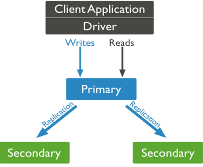

# Interrogation d'une base de données MongoDB
L'objectif dans ce qui suit est d'installer et d'importer des données dans le SGBD MongoDB, un système NoSQL orienté documents. On commence par télécharger la version community qui se trouve à l'adresse suivante : https://www.mongodb.com/try/download/community (version 3.2.22)

On lance les deux commandes suivantes ``mongod`` pour le serveur et ``mongo``pour le client. On commence par appréhender MongoDB, en utilisant le client ``mongo`` et puis utiliser un client graphique tel que ``Robo 3T``. 

Remarque  : le dossier de sauvegarde des bases de données par défaut de MongoDB est ``/data/db``.  Si vous ne voullez pas utiliser ce répertoire mais un autre ``mongod --dpath $repetoiredesauvegarde``. Le port d'écoute par défaut de MongoDB est ``27017``. 


Pour créer une base de donnée `use contacts`; (on utilise un intérpreteur Javascript). 

Pour créer une collection `db.createCollection("amis");` 

Pour créer une deuxième collection `db.cretaeCollection("profesionels")`;

Ajouter un document dans une collection `db.amis.insert({"prenom":"samir"})`; 

Il n'existe pas de schéma pour une base de données NoSQL en général. On peut donc insérer des éléments qui n'ont rien à voir les uns avec les autres. ``db.amis.insert({"numero":1234, "nom":"Alfred", "Tel":0665434343})``;

Le langage d'interoggartion d'une base de données MongoDB est propre à ce système et ne peut être utiliser pour interogger un autre de système de gestion de bases de données (contrairement à SQL). 

Pour afficher toutes les collections ``show collections;``

Pour afficher tous les documents ``db.amis.find();``  

``{ "_id" : ObjectId("619e30bbf168d42f513793ae"), "nom" : "Youcef", "telephone" : 14112994 }``MongoDB attribué un identifiant unique pour chaque document. On peut nous-mêmes donner un identifiant que l'on veut insérer ``db.amis.insert({"_id":1, "nom":"samuel", "Tel":065454321});``.  


Pour parcourir toute une collection : ``db.films.find();``

Pour compter le nombre d'éléments d'une collection ``db.films.find();``

Pour afficher les 15 éléments d'une collection à partir du 11 ème élément ``db.amis.find().skip(1).limit(12)`` 

Pour trier une collection ``db.films.find().sort({"nom":1})`` La valeur 1 est pour le tri décroissant et -1 pour un tri croissant. 

Pour chercher un élément sachant son identifiant ``db.amis.find({"_id":1})``

On peut faire une recherche en utilisant des motifs plus complexe ``db.amis.find({"nom":"Youcef", "telephone":14112994})``


Télécharger le document json des restaurants de New-York. 

Pour importer des données dans MongoDB : ``$MONGO/bin/mongoimport --db mabase --collection restaurants $chemin/restaurants.json``. ``mabase``est le nom de votre base de données, et ``restaurants``est le nom de votre collection. 


#### Filtrage et projection avec un motif JSON


#### Création d'une séquence d'opérations

#### Mise à jour des données


# Map-reduce 


# Protéger vos données grâce au ReplicaSet


La réplication des données sert essentiellement à atteindre deux objectifs :

1. Tolérance aux pannes : si un serveur, un disque tombe en panne, une données reste toujours disponible ;
2. Scalabilité 
	
	
	
	2.1. Distribution des lectures : les lectures sont réparties sur plusieurs serveurs (scalabilité) 
	
	2.2. Distribution des écritures 	si un serveur est très chargé en cas d'écriture, on utilise un autre serveur. Remarque : la plus part des systèmes ne distribuent des écriture (il faut réconcilier des données). 
	
	
	Méthode générale de réplication : soit un client (X) et un serveur S1. Le client soumet une requête d'écriture au serveur. Le serveur écrit le document sur le disque et en cas de réplication transmet la demande aux autres serveurs s2, ..., sn qui feront de même et uniquement une fois que tous les serveurs ont terminé l'écriture sur disque  que le serveur s1 (serveur principal) envoie un acquittement au client.  C'est qu'on appelle le mode de réplication **Synchrone**.  C'est un mode qui favorise **la cohérence des données**. 
	
	Il existe un autre type (ou mode) de réplication dit **asynchrone**. Dans ce cas, le serveur s1 écrit sur son propre disque et rend la main au client X et transmet la demande d'écriture aux autres serveurs s2, ..., sn. C'est un mode qui favorise **les performances (temps de réponse)**.


Trois copies pour une sécurité totale et deux au minimum.


#### Mise en oeuvre d'une architecture tolérante aux pannes avec MongoDB 





Pour instancier une Replicaset qui permet de gérer la tolérance aux pannes, par exemple composé de trois serveurs (un ``Primary`` et deux ``Secondary``), il faut définir. 

**Bref rappel**  Une application (client) se connecte directement se connecte directemnent au serveur principal (``primary``) pour toutes opérations de lecture et d'écriture. On associe à ce serveur ``primary``un ensemble de serveurs ``secondary``. Ces derniers ont pour rôle de répliquer les données provenant du serveur ``primary`` . 

1. Donner un nom au Replicatset ``test``
2. Associer un port d'écoute pour chaque serveur
3. Définir un répertoire de stockage pour chaque serveur 
4. Lancer les serveurs
5. A ce stade le ``replicaset``n'existe pas, il faut donc connecter les serveurs


Soit data1, data2, data3 les répertoire de stockage des serveurs S1, S2 et S3 qui écoutent sur les port 27020, 27021, 27022 respectivemnent. 


Pour connecter les serveurs, on procède de la façon suivante : 

On lance les trois serveurs : 


``mongod --replSet rscm --port 27021 --dbpath data1``, ``mongod --replSet rscm --port 27022 --dbpath data2`` et ``mongod --replSet rscm --port 27023 --dbpath data3``


On se connecte au serveur principal S1, par exemple, ``mongo --port 27021`` et on initialise le replicaset ``rs.initiate(configuration)``. 

Le contenu du fichier configuration est : 


```json 
rs.initiate(
   {
      _id: "test",
      version: 1,
      members: [
         { _id: 0, host : "localhost:27021" },
         { _id: 1, host : "localhost:27022" },
         { _id: 2, host : "localhost:27023" }
      ]
   }
)

```

Pour voir la configuration d'un replicaset ``rs.conf();``.   La méthode ``rs.status()``nous donne des information sur qui est le serveur ``primary``et qui sont les serveurs ``secondary``. 


En cas de panne du serveur ``primary``, il peut y avoir un très grand délais de latence (dégradation donc des performance). Pour y remédier, on peut utiliser un serveur qui joue le rôle d'arbitre. 

Pour définir un arbitre, comme pour le autre serveurs qui font partie de cette architecture tolérante aux pannes, on définit le répertoire de stockage ``dataar`` et le lancer : ``rs.addArb("localhost:20724");``. Pour pouvoir lancer un serveur qui jouera le rôle d'un arbitre, il faut absolument le faire à partir du serveur ``primary``. 


**Remarque** pour limiter la taille du fichier log créer au moment du lancement du serveur, on peut utiliser l'option  ``--oplogSize 500``. 


# Distribuer vos données avec MongoDB


# Travail à rendre : 


#### Travail à rendre 

Développer un micro-service qui utilise pour la persistance des données MongoDB. Créer une image Docker de votre service et renseigner le lien au début (vraiment au début) de votre redme.md pour la télécharger.  


